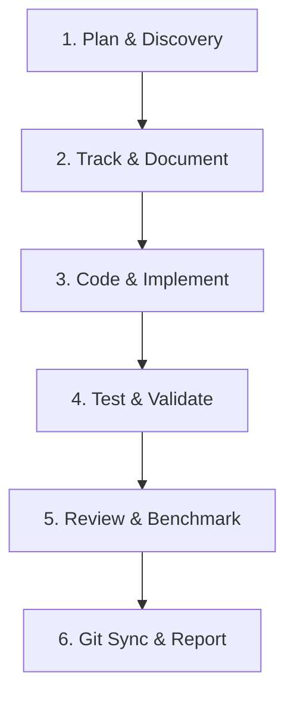

# Autonomous Agent Lifecycle & Execution Plan
**Platform:** Hadhramout Center for Historical Studies, Documentation and Publishing  
**Engineering Lead:** Eng. Abdulrahman Khaled Radwan (`ak01redwan`) — Novixa (`Novixa`)

---

## 1. The Autonomous Continuous Loop
Every agent working on this repository must execute tasks following this strict 6-stage lifecycle:

### Stage 1: Planning & Discovery
- Thoroughly inspect existing code, documentation in `docs/`, `MASTER_STRATEGY_HADRAMOUT_NOVIXA.md`, `PRD.md`, and `data.js`.
- Cross-reference client requirements with real-world institutional standards (scholarly archives, digital humanities platforms like King Faisal Center, Qatar Digital Library, British Library Endangered Archives).
- Identify edge cases, missing data, or performance bottlenecks before writing code.

### Stage 2: Tracking & Documentation
- Log intended architectural decisions in `DECISIONS.md`.
- Keep `TODO.md` and `PROJECT_STATUS.md` in sync with active milestones and deliverables.
- Record breaking changes or functional increments in `CHANGELOG.md`.

### Stage 3: Developing & Implementing
- Apply changes adhering to `.agents/rules/engineering-standards.md`.
- Keep code clean, modular, and self-documenting.
- Avoid introducing external unneeded dependencies or heavy build tooling.

### Stage 4: Testing & Validation
- Run automated sanity scripts: `node scripts/validate.js`.
- Perform headless browser or live browser verification across multiple viewports (Mobile 375px, Tablet 768px, Desktop 1280px).
- Verify RTL/LTR parity, Dark/Light theme switching, local storage persistence, search filtering, and citation generation.

### Stage 5: Review & Benchmarking
- Review diffs via `git diff` to ensure zero unintended changes or leftover debugging artifacts.
- Verify asset loading and error-free console logs.

### Stage 6: Git Synchronization & Reporting
- Stage all modified files using descriptive conventional commits (see `.agents/rules/git-workflow.md`).
- Push immediately to `origin/master`.
- Generate clear, professional Arabic summary reports for the engineering lead and stakeholders.
