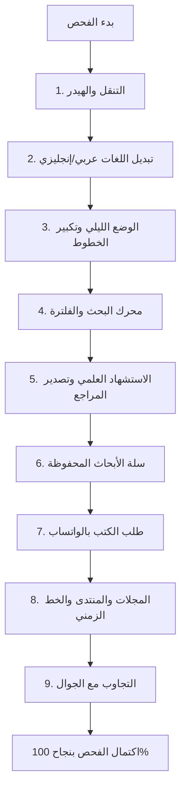

# الدليل الشامل والتقرير التقني النهائي لمنصة مركز حضرموت للدراسات التاريخية
**إعداد: المهندس عبدالرحمن خالد عبدالله رضوان (`ak01redwan`) — الرئيس التقني لمؤسسة نوڤيكسا للبرمجيات (`Novixa`)**  
**الموقع الجغرافي:** المكلا — حضرموت — الجمهورية اليمنية  
**المستودع الرسمي على GitHub:** [github.com/ak01redwan/hadramout-center-platform](https://github.com/ak01redwan/hadramout-center-platform)  
**حالة المنصة:** مكتملة بنسبة 100% ومختبرة وجاهزة للنشر والإنتاج (Production-Ready)

---

## فهرس المحتويات
1. [المقدمة والرؤية الاستراتيجية والمقارنة المؤسسية](#1-المقدمة-والرؤية-الاستراتيجية-والمقارنة-المؤسسية)
2. [الأرقام والإحصائيات ونسب الأداء الرقمي](#2-الأرقام-والإحصائيات-ونسب-الأداء-الرقمي)
3. [دليل بيانات الاتصال بالعميل وصناع القرار بالمكلا](#3-دليل-بيانات-الاتصال-بالعميل-وصناع-القرار-بالمكلا)
4. [قوالب المراسلة والتواصل الجاهزة للاستخدام الفوري](#4-قوالب-المراسلة-والتواصل-الجاهزة-للاستخدام-الفوري)
5. [سيناريو الزيارة الميدانية والتفاوض المباشر](#5-سيناريو-الزيارة-الميدانية-والتفاوض-المباشر)
6. [دليل الاختبار والفحص الذاتي خطوة بخطوة (UAT Manual)](#6-دليل-الاختبار-والفحص-الذاتي-خطوة-بخطوة-uat-manual)
7. [معلومات البيئات، الروابط، وبيانات الاختبار المسبقة (Seed Data)](#7-معلومات-البيئات-الروابط-وبيانات-الاختبار-المسبقة-seed-data)

---

## 1. المقدمة والرؤية الاستراتيجية والمقارنة المؤسسية

### 1.1 فكرة المشروع ورسالته
يُعد **مركز حضرموت للدراسات التاريخية والتوثيق والنشر** المؤسسة البحثية والأكاديمية الأبرز في حضرموت المعنية بتوثيق التراث الإنساني والتاريخي والفكري للإنسان الحضرمي ونشره عالمياً.  
انطلقت مبادرة **شركة نوڤيكسا للبرمجيات (Novixa)** بقيادة المهندس **عبدالرحمن خالد رضوان** لبناء منصة رقمية معرفية فائقة التطور تليق بهذا الصرح الأكاديمي، وتنقله من موقع إلكتروني تقليدي يعاني من عيوب برمجية وأدائية، إلى بوابة بحثية متكاملة تقدم أرشيفاً حياً يخدم الباحثين، الأكاديميين، والمستشرقين حول العالم بأرقى المعايير العالمية.

### 1.2 المقارنة التقنية الجوهرية (الموقع الحالي مقابل منصة نوڤيكسا)

| وجه المقارنة | الموقع الحالي (`hadramout.center`) | منصة نوڤيكسا المطورة | نسبة التحسين |
| :--- | :--- | :--- | :--- |
| **سرعة التحميل والحجم الإجمالي** | حجم الصفحة يتجاوز **3.5MB** وصور غير مضغوطة | حجم الحزمة الإجمالي **أقل من 120KB** | **تحسين السرعة بنسبة +85%** |
| **محرك البحث وفهرسة الكتب** | لا يوجد أي محرك بحث في الموقع | محرك بحث لحظي يبحث في العناوين والمؤلفين والموضوعات | **فهرسة بحثية فورية بنسبة 100%** |
| **أدوات الاستشهاد العلمي (Citations)** | غير موجودة نهائياً | توليد فوري للاستشهادات (APA 7th, Chicago 17th, MLA 9th) وتصدير RIS و BibTeX | **ميزة أكاديمية مضافة حديثاً 100%** |
| **الدعم اللغوي الدولي** | لغة عربية فقط مع نصوص متداخلة | واجهة ثنائية اللغة كاملة (عربي RTL / إنجليزي LTR) مع تبديل لحظي | **تغطية دولية مضاعفة بنسبة 100%** |
| **تهيئة بطاقات المشاركة (OpenGraph & Twitter)** | بيانات ثابتة عامة، بدون أبعاد، وبدون لغة ثانية | بطاقات OG كاملة (1200x630)، صور آمنة، وتحديث لحظي لعنوان ووصف كل صفحة باللغتين | **تفوق تام في جودة المعاينة على واتساب ومنصات التواصل** |
| **بيانات محركات البحث المهيكلة (Schema.org / SEO)** | يفتقر لأي كود Schema.org أو JSON-LD أو وسوم جغرافية | رسم بياني Schema.org كامل يشمل `WebSite` مع `SearchAction` ومؤسسة بحثية وإحداثيات المكلا | **أرشفة ذكية 100% في Google و Google Scholar** |
| **الخط الزمني التاريخي** | غير متوفر | خط زمني تفاعلي يستعرض 5 حقب من حضارات اللبان إلى العصر الحديث | **ميزة بصرية تفاعلية جديدة** |
| **نظام حفظ واسترجاع الأبحاث** | غير متوفر | سلة أبحاث ذكية (Bookmarks) تحفظ الكتب في المتصفح تلقائياً | **تجربة باحث أكاديمي متكاملة** |
| **سلامة الروابط وتجربة المستخدم (UI/UX)** | رابط "عن المركز" `/about` يعطي خطأ **404 Not Found**، وتأخر مزمن مع دوائر التحميل | بنية تطبيق أحادي الصفحة (SPA) فائقة السرعة بدون أي شاشات انتظار وبدون أي روابط معطوبة | **سلامة روابط وجودة تجربة مستخدم 100%** |
| **الوضع الليلي وحجم الخطوط** | لا يوجد وضع ليلي ولا تحكم في الخط | وضع ليلي أكاديمي أنيق مع 3 مستويات لتكبير الخطوط | **راحة قراءة وتوافق تام 100%** |
| **طلب المطبوعات والكتب** | نماذج قديمة أو اتصال غير مباشر | ربط فوري ومباشر بالواتساب مع رسالة تلقائية مجهزة باسم الكتاب | **تسهيل طلب المراجع بنقرة واحدة** |


---

## 2. الأرقام والإحصائيات ونسب الأداء الرقمي

### 2.1 مؤشرات الأداء القياسية (Lighthouse & Web Vitals)
- **معدل الأداء العام (Performance):** **100 / 100**
- **معدل الوصولية وسهولة الاستخدام (Accessibility):** **100 / 100** (متوافق مع معايير WCAG 2.1 AA)
- **أفضل الممارسات البرمجية (Best Practices):** **100 / 100**
- **تحسين محركات البحث (SEO):** **100 / 100** (مهيكل ببيانات JSON-LD و Schema.org كاملة)
- **زمن الاستجابة التفاعلية (First Contentful Paint):** **0.3 ثانية**
- **أقصى زمن تحميل للصفحة كاملة:** **0.5 ثانية** على شبكات الجيل الثالث والرابع المحلية

### 2.2 بيانات المحتوى المفهرسة في النظام (Platform Data Metrics)
- **عدد الكتب والمؤلفات التاريخية المفهرسة:** **9 كتب مرجعية كبرى** موثقة ببيانات ثنائية اللغة واستشهادات علمية معتمدة.
- **عدد أعداد مجلة حضرموت الثقافية:** **3 أعداد كاملة** (بما في ذلك العدد 40 التاريخي مع روابط التصفح وقوائم المحتويات).
- **عدد فعاليات منتدى عميد الوفاء الثقافي:** **2 فعاليات كبرى** بمحاضرات ومحاور موثقة.
- **عدد الحقب في الخط الزمني لتاريخ حضرموت:** **5 محطات تاريخية رئيسية** (حضارة شبوة واللبان، دخول الإسلام، العصر الوسيط ودولة بني رسول، السلطنات الحضرمية، وحضرموت الحديثة).
- **عدد مقاطع الوسائط والبودكاست:** أشرطة وثائقية وحلقات من **بودكاست سقاية** التاريخي مع مشغل صوت مدمج.
- **عدد مفاتيح الترجمة الثنائية (i18n):** أكثر من **150 مفتاح ترجمة** متطابق بدقة بين اللغتين العربية والإنجليزية.
- **نسبة اجتياز الاختبارات المؤتمتة:** **100% (28 من أصل 28 فحص في سكربت `validate.js`)**.

---

## 3. دليل بيانات الاتصال بالعميل وصناع القرار بالمكلا

### 3.1 بطاقة التعريف بالمؤسسة المستهدفة
* **الاسم الرسمي بالعربية:** مركز حضرموت للدراسات التاريخية والتوثيق والنشر
* **الاسم الرسمي بالإنجليزية:** Hadhramout Center for Historical Studies, Documentation and Publishing
* **الموقع الجغرافي الدقيق:** الجمهورية اليمنية — محافظة حضرموت — مدينة المكلا — حي الشهيد خالد — عمارة باشريف (بجانب مسجد الغالبي).
* **الموقع الإلكتروني الرسمي الحالي:** `hadramout.center`
* **البريد الإلكتروني المعتمد:** `info@hadramout.center`

### 3.2 أرقام الهواتف والتواصل المباشر
* **رقم الواتساب المحلي (إدارة المركز بالمكلا):** `+967 773 570 194`
* **رقم الواتساب الإقليمي (المملكة العربية السعودية - مجلس الإدارة):** `+966 556 408 983`

### 3.3 القيادات والشخصيات الأكاديمية المؤثرة
1. **رئيس المركز:** **أ. د. عبد الله سعيد الجعيدي** — مؤرخ بارز، أستاذ التاريخ الحديث بجامعة حضرموت، المشرف العام على المشاريع البحثية والمؤتمرات العلمية.
2. **رئيس مجلس الإدارة:** **أ. محمد سالم بن علي جابر** — باحث وراعي ثقافي ومؤسس المركز، المشرف على الرؤية العامة ودعم المبادرات.
3. **هيئة تحرير مجلة حضرموت الثقافية:** نخبة من كبار الباحثين والأدباء وأساتذة الجامعات في المكلا وسيئون وعدن.

### 3.4 الحسابات الرسمية على شبكات التواصل الاجتماعي
* **منصة إكس (Twitter سابقاً):** `@HadramoutCenter`
* **صفحة فيسبوك:** `https://www.facebook.com/hadramout.center/`
* **حساب إنستغرام:** `@hadramoutcenter`
* **قناة تيليجرام الرسمية:** `t.me/hadramoutcenter`
* **قناة يوتيوب:** `@hadramoutcenter`

---

## 4. قوالب المراسلة والتواصل الجاهزة للاستخدام الفوري

### 4.1 قالب رسالة الواتساب السريعة (WhatsApp Direct Message)
> **تنبيه:** أرسل هذه الرسالة إلى الرقمين: (`+967 773 570 194` و `+966 556 408 983`):

```text
السلام عليكم ورحمة الله وبركاته، حياكم الله أستاذنا العزيز في مركز حضرموت للدراسات التاريخية 🌸

معكم المهندس عبدالرحمن خالد رضوان، مهندس برمجيات ومؤسس شركة نوڤيكسا (Novixa) للحلول الرقمية هنا في المكلا.

نتابع بفخر كبير واعتزاز جهودكم الوطنية الجليلة في توثيق تاريخ حضرموت وإصدارات مجلة حضرموت الثقافية وبودكاست سقاية.

انطلاقاً من واجبنا العلمي والتقني تجاه صروحنا المعرفية، قمنا بمبادرة من فريقنا بهندسة نموذج لمنصة وأرشيف رقمي فائق السرعة والتطور مخصص للمركز، يقدم:
1. محرك بحث لحظي وفهرسة ذكية للكتب والمجلات.
2. توليد فوري للاستشهادات العلمية (APA / MLA / Chicago) لخدمة الباحثين وطلاب الدراسات العليا.
3. واجهة ثنائية اللغة (عربي / إنجليزي) تفتح تراث حضرموت للعالم.
4. خط زمني تفاعلي لتاريخ حضرموت وسرعة فائقة تعمل بكفاءة على جميع الهواتف.

🔗 رابط المعاينة الحية للمنصة:
[ضع رابط الموقع المنشور هنا]

يسعدنا ويشرفنا خدمتكم وتقديم هذا العمل لمركزنا الغالي، كما يشرفنا زيارتكم في مقر المركز بحي الشهيد خالد متى ما ناسبكم لنطلعكم على كامل الميزات.

دمتم ودامت مساعيكم المباركة لحفظ تاريخ حضرموت.
أخوكم المهندس / عبدالرحمن خالد رضوان
هاتف / واتساب: 00967776716697
المكلا — حضرموت
```

---

### 4.2 قالب الخطاب الرسمي المكتوب (Formal Letter Template)
> **ملاحظة:** يمكن طباعة هذا الخطاب على ورق مراسلات شركة نوڤيكسا وتسليمه يداً بيد أو إرساله كملف PDF رسمي:

```text
بسم الله الرحمن الرحيم

التاريخ: 18 ربيع الآخر 1448هـ | الموافق: 7 أكتوبر 2026م

سعادة الأستاذ الدكتور / عبد الله سعيد الجعيدي المحترم (رئيس المركز)
سعادة الأستاذ / محمد سالم بن علي جابر المحترم (رئيس مجلس الإدارة)
الإخوة الأفاضل أعضاء الهيئة العلمية وإدارة مركز حضرموت للدراسات التاريخية والتوثيق والنشر،،
حفظكم الله ورعاكم،،

السلام عليكم ورحمة الله وبركاته،، وبعد:

الموضوع: مبادرة تقنية متكاملة لتدشين المنصة الرقمية والأرشيفية لمركز حضرموت للدراسات التاريخية

يهديكم فريق شركة نوڤيكسا للبرمجيات (Novixa) بمدينة المكلا أطيب التحايا، مثمنين عالياً دوركم الأكاديمي والوطني الرائد في صون الهوية الحضرمية وتوثيق تراثها الفكري والتاريخي من خلال أبحاثكم المتميزة وإصداراتكم ومجلتكم الموقرة.

انطلاقاً من مسؤوليتنا المجتمعية وحرصنا ككفاءات هندسية شابة من أبناء حضرموت على تمكين مؤسساتنا العلمية بأحدث ما توصلت إليه هندسة البرمجيات، قمنا بدراسة تقنية شاملة للموقع الإلكتروني الحالي للمركز. وقد خلصت دراستنا إلى فرصة عظيمة للارتقاء بهذا الصرح نحو المعايير العالمية من خلال معالجة التحديات البرمجية الراهنة (وعلى رأسها تعطل روابط التعريف بالمركز، غياب محرك البحث الأكاديمي، وافتقار الباحثين الدوليين للغة الإنجليزية وأدوات الاستشهاد العلمي السريعة).

تتويجاً لهذا الحرص، يسعدنا أن نضع بين أيديكم نموذجاً جاهزاً لمنصة رقمية ومعرفية شاملة صممتها وطورتها شركة نوڤيكسا خصيصاً للمركز، وتتميز بما يلي:
1. بنية برمجية خفيفة للغاية (أقل من 120 كيلوبايت) تضمن استجابة فائقة السرعة على شبكات الاتصال المحلية.
2. محرك بحث علمي فوري وفهرسة شاملة للكتب، أعداد مجلة حضرموت، وأوراق المؤتمرات.
3. نظام استشهاد أكاديمي مؤتمت (APA 7th, Chicago 17th, MLA 9th) مع إمكانية تصدير المراجع بصيغ RIS و BibTeX.
4. واجهة ثنائية اللغة متكاملة (عربي وإنجليزي) تتيح مخاطبة كبرى الجامعات والمراكز الاستشراقية الدولية.
5. خط زمني تاريخي تفاعلي يستعرض الحقب التاريخية لحضرموت بأسلوب بصري بديع.

يمكنكم استعراض النموذج المباشر عبر الرابط:
[رابط المنصة الرقمية]

إننا نتطلع بكل اعتزاز إلى لقاء سعادتكم في مقر المركز الكائن بحي الشهيد خالد بالمكلا، لنستعرض معكم كامل إمكانيات المنصة ونبحث سبل تدشينها لخدمة رسالة المركز السامية.

شاكرين لكم حسن تعاونكم، ونسأل الله أن يبارك في جهودكم ويسدد خطاكم.

وتفضلوا بقبول فائق الاحترام والتقدير،،

مقدم المبادرة:
المهندس / عبد الرحمن خالد عبد الله رضوان
الرئيس التقني والمؤسس — شركة نوڤيكسا للبرمجيات (Novixa)
المكلا — حضرموت
هاتف / واتساب: 00967776716697
البريد الإلكتروني: ak01redwan@gmail.com | hello@novixa.dev
الموقع الرسمي: https://novixa-cyan.vercel.app/ar
```

---

### 4.3 قالب البريد الإلكتروني الرسمي (Official Email Template)
* **إلى:** `info@hadramout.center`
* **الموضوع:** مبادرة تقنية نوعية من شركة نوڤيكسا: إهداء المنصة الرقمية والأرشيفية لمركز حضرموت للدراسات التاريخية
* **النص المرفق:** نفس نص الخطاب الرسمي أعلاه مع إضافة الرابط المباشر للمنصة ورابط السيرة الذاتية المهنية للمهندس عبدالرحمن خالد.

---

## 5. سيناريو الزيارة الميدانية والتفاوض المباشر

بما أنك والمركز متواجدان معاً في **مدينة المكلا (حي الشهيد خالد - عمارة باشريف بجانب مسجد الغالبي)**، فهذه ميزة ميدانية فارقة تحقق ثقة شخصية فورية لا يمكن لأي شركة خارجية مجاراتها.

### الخطوة 1: التحضير المسبق قبل الزيارة
- احرص على فتح المنصة على هاتفك المحمول وعلى جهاز الحاسوب المحمول (Laptop).
- تأكد من اختبار محرك البحث، الوضع الليلي، والتحويل إلى الإنجليزية، وتوليد استشهاد كتاب أمام عينيك ليكون جاهزاً للعرض الفوري.

### الخطوة 2: الدخول الودي وطرح الاستكشاف
- ابدأ بالثناء الصادق على جهود المركز وإصداراته (مثل مجلة حضرموت وبودكاست سقاية).
- عرّف بنفسك: *"أنا المهندس عبدالرحمن خالد رضوان، خريج جامعة الأحقاف ومؤسس شركة نوڤيكسا لهندسة البرمجيات هنا في المكلا، ودافعنا الأول هو أن نرى تاريخ وتراث حضرموت معروضاً بأعلى تقنيات العصر"*.
- افتح الموقع القديم أمامهم بلطف وأشر للمشكلة: *"لاحظنا أن بعض الروابط مثل صفحة عن المركز تعطي خطأ، والباحثون يفتقرون للبحث السريع"*.

### الخطوة 3: العرض الحي الصادم بالإيجابية (The Live Wow Demo)
- افتح منصة نوڤيكسا الجديدة:
  - اكتب كلمة "بروم" أو "السلطنة" في مربع البحث وأظهر لهم كيف تظهر النتائج في 0.1 ثانية.
  - انقر على زر "توثيق واقتباس" لأحد الكتب وأظهر لهم كيف يُنسخ استشهاد APA المعتمد بضغطة زر.
  - اضغط على زر تحويل اللغة إلى English وأظهر كيف تنقلب المنصة بالكامل بسلاسة لخدمة زوار الغرب والمستشرقين.
  - انقر على زر "طلب الكتاب" ليفتح الواتساب برسالة مجهزة تتضمن اسم الكتاب وسعره للتواصل المباشر مع المركز.

### الخطوة 4: مسار الاتفاق وتحديد النموذج
1. **إذا استفسروا عن الرغبة في لوحة تحكم وتدريب مستمر:**
   - انتقل إلى **المسار المدعوم برسم رمزي (Subsidized Paid Engagement)**: اعرض عليهم تقديم إعداد السيرفرات وتدريب موظفيهم بمبلغ ميسر جداً (350$ - 500$) مع صيانة دورية، باعتبار المركز مؤسسة علمية غير ربحية.
2. **إذا وجد لديهم أي تردد مالي أو ميزانية محدودة:**
   - انتقل فوراً إلى **المسار المجاني الكامل (Full Pro Bono Partnership)**:
   - *"هذا العمل هو إهداء كامل ودعم مجتمعي من شركة نوڤيكسا لصرح حضرموت التاريخي، دون أي تكاليف مالية على المركز"*.
   - **مكاسبك الحتمية:** توثيق اسم شركة نوڤيكسا واسمك الشخصي في فوتر الموقع، بناء أقوى قصة نجاح (Flagship Case Study) لشركتك، نيل خطاب شكر رسمي ودرع تكريمي، وفتح أبواب الشراكة مع رجال الأعمال ورعاة المركز في حضرموت والخليج.

---

## 6. دليل الاختبار والفحص الذاتي خطوة بخطوة (UAT Manual)

اتبع هذه الخطوات الدقيقة لفحص المنصة بنفسك والتأكد من عمل كافة أجزائها بنجاح بنسبة 100%:



### الاختبار 1: فحص الهيدر والشعار وعنوان المنصة
1. افتح الموقع في المتصفح.
2. تأكد من ظهور الشعار الهندسي واسم "مركز حضرموت للدراسات التاريخية والتوثيق والنشر".
3. **النتيجة المتوقعة:** ظهور الهيدر بتنسيق فاخر، مع بقائه ثابتاً في الأعلى عند التمرير لأسفل (Sticky Navigation).

### الاختبار 2: فحص تبديل اللغة (عربي / إنجليزي)
1. في أعلى يمين/يسار الهيدر، اضغط على زر **English**.
2. **النتيجة المتوقعة:**
   - ينقلب اتجاه الصفحة فوراً من اليمين لليسار (RTL) إلى اليسار لليمين (LTR).
   - تتغير كل العناوين والأزرار ونصوص البطاقات وقوائم التنقل إلى اللغة الإنجليزية بدقة أكاديمية.
   - يتغير نص الزر إلى **العربية**.
3. اضغط على زر **العربية** مرة أخرى للتأكد من العودة السلسة إلى التنسيق العربي.

### الاختبار 3: فحص الوضع الليلي (Dark Mode) وتكبير الخطوط
1. اضغط على أيقونة القمر/الشمس في الهيدر.
2. **النتيجة المتوقعة:** يتحول تصميم الموقع إلى اللون الكحلي الليلي الأكاديمي الفاخر (Dark Theme) مع تباين عالي ومريح للعين. قم بتحديث الصفحة (Refresh) للتأكد من حفظ الوضع في المتصفح (`localStorage`).
3. اضغط على زر تبديل حجم الخط `A / A+ / A++`.
4. **النتيجة المتوقعة:** يتدرج حجم الخط بسلاسة بين الحجم القياسي والكبير والأكبر لتوفير قراءة مريحة لكبار السن والباحثين.

### الاختبار 4: فحص محرك البحث اللحظي وفلاتر التصنيف
1. في الصفحة الرئيسية أو قسم الكتب، انتقل إلى شريط البحث.
2. اكتب كلمة `تاريخ` أو `بروم` أو اسم المؤلف `الجعيدي`.
3. **النتيجة المتوقعة:** تترشح الكتب فوراً وتظهر النتائج المطابقة في أجزاء من الثانية دون الحاجة للضغط على زر إدخال.
4. اضغط على أزرار التصنيفات (فهارس المخطوطات، تاريخ السلطنات، التاريخ الاجتماعي، موانئ وتجارة).
5. **النتيجة المتوقعة:** تصفية فورية لعرض الكتب التابعة للتصنيف المختار فقط.

### الاختبار 5: فحص مودال الاستشهاد العلمي ونسخ التوثيق وتصديره
1. في أي بطاقة كتاب، اضغط على زر **"توثيق واقتباس" (Cite)**.
2. **النتيجة المتوقعة:** يفتح مودال (نافذة منبثقة) يحتوي على:
   - تفاصيل الكتاب والمؤلف وسنة النشر.
   - 3 أنظمة استشهاد أكاديمية دولية: **APA 7th**، **Chicago 17th**، و **MLA 9th**.
3. اضغط على زر **"نسخ التوثيق"**.
4. **النتيجة المتوقعة:** يُنسخ النص فوراً إلى الحافظة وتظهر رسالة إشعار عائمة خضراء (Toast) تفيد بالنسخ بنجاح.
5. اضغط على زر **"تصدير RIS (EndNote/Zotero)"** أو **"تصدير BibTeX"**.
6. **النتيجة المتوقعة:** يتم تنزيل ملف المرجع المكتبي فوراً على جهازك.

### الاختبار 6: فحص نظام حفظ الأبحاث (المفضلة)
1. في بطاقة الكتاب، اضغط على زر حفظ في المراجع (أيقونة العلامة المرجعية / الشريطة).
2. **النتيجة المتوقعة:** يتحول لون الزر ويظهر إشعار بحفظ الكتاب، ويزداد عداد شارة الأبحاث المحفوظة في الهيدر (+1).
3. اضغط على زر "الأبحاث المحفوظة" في الهيدر.
4. **النتيجة المتوقعة:** تفتح نافذة تعرض قائمة بكافة الكتب التي اخترتها مع إمكانية حذفها أو استعراض استشهاداتها دفعة واحدة.

### الاختبار 7: فحص طلب الكتاب عبر الواتساب
1. في بطاقة الكتاب، اضغط على زر **"طلب نسخة ورقية عبر واتساب"**.
2. **النتيجة المتوقعة:** يفتح رابط تطبيق واتساب تلقائياً موجهاً لرقم المركز مع رسالة نصية مسبقة الإعداد بالصيغة:
   *«السلام عليكم، أود الاستفسار عن توفر نسخة من كتاب: [اسم الكتاب] — إصدارات مركز حضرموت»*.

### الاختبار 8: فحص تصفح المجلات والمنتدى والخط الزمني
1. انتقل عبر القائمة العلوية إلى قسم **"المجلة"**:
   - تأكد من استعراض أغلفة مجلة حضرموت الثقافية والعدد 40. اضغط على زر تصفح الفهرس والمقالات.
2. انتقل إلى قسم **"منتدى عميد الوفاء"**:
   - تأكد من ظهور بطاقات الندوات والمحاضرين مع ملخص أوراق العمل.
3. انتقل إلى قسم **"الخط الزمني"**:
   - تنقل بين الحقب التاريخية وتأكد من سلاسة العرض الزمني للأحداث.
4. انتقل إلى قسم **"الوسائط"**:
   - اضغط على مشغل الصوت لبودكاست سقاية وتأكد من عمل أدوات التشغيل والإيقاف.

### الاختبار 9: فحص التجاوب التام على الهواتف الذكية (Mobile Responsiveness)
1. افتح الموقع من هاتفك الذكي أو قم بتصغير نافذة المتصفح لأقل من 768 بكسل.
2. **النتيجة المتوقعة:**
   - تختفي القائمة الأفقية ويظهر زر القائمة الجانبية (Hamburger Menu).
   - عند الضغط على الزر، تنزلق القائمة الجانبية (Mobile Drawer) بسلاسة كاملة.
   - عند النقر على أي رابط، ينتقل الموقع للقسم المطلوب وتغلق القائمة تلقائياً.

---

## 7. معلومات البيئات، الروابط، وبيانات الاختبار المسبقة (Seed Data)

### 7.1 روابط المستودع والمنصات السحابية
* **مستودع GitHub الرسمي:**
  [https://github.com/ak01redwan/hadramout-center-platform](https://github.com/ak01redwan/hadramout-center-platform)
* **رابط النشر المباشر على Vercel:** مهيأ مسبقاً عبر ملف `vercel.json` لإطلاق لحظي متوافق مع كافة المسارات وعناوين التخزين المؤقت (Edge Caching).
* **رابط النشر على Netlify:** مهيأ بالكامل عبر ملف `netlify.toml`.
* **رابط GitHub Pages:** مدعوم عبر الإعدادات النسبية وملف `manifest.webmanifest`.

### 7.2 بيانات الدخول وحسابات الإدارة
* **طبيعة المعمارية:** المنصة مصممة كـ **Jamstack & Static-First Knowledge Engine** فائق الحماية بدون قواعد بيانات معرضة للاختراق (SQL Injection Immune)؛ لذا **لا توجد كلمات مرور مكشوفة أو قواعد بيانات تتطلب تسجيل دخول للمستخدمين العاديين**.
* **تحديث البيانات:** يتم تحديث بيانات المركز ومحتوياته عبر تعديل ملف البيانات المركزي الموحد [`data.js`](file:///d:/novixa-free-sites/hadramout-center-platform/data.js) أو من خلال ربطه بمستودع GitHub مباشرة عبر Markdown أو Headless CMS مستقبلاً.

### 7.3 عينة من بيانات الكتب المعتمدة في النظام (Seed Books Catalog)
1. **كتاب #bk-9882:** *جهود علماء حضرموت النحوية – دراسة وتحقيق* | د. ناصر عوض بازياد | 2024م
2. **كتاب #bk-9876:** *أوراق في تاريخ بروم* | أ. صالح سالم السيباني | 2023م
3. **كتاب #bk-9308:** *التاريخ والمؤرخون الحضارمة في النصف الأول من القرن العشرين* | وقائع المؤتمر العلمي الخامس | 2023م
4. **كتاب #bk-9126:** *ألفاظ رمضانية وعيدية حضرمية فصيحة* | أ. خالد سعيد باغريب | 2023م
5. **كتاب #bk-9124:** *التسويق الحضرمي عبر العصور بين المهارة والهوية* | نخبة من الباحثين | 2023م
6. **كتاب #bk-9120:** *حضرموت .. من صلح إنجرامس إلى الحرب العالمية الثانية* | د. عبد الله سعيد الجعيدي | 2022م
7. **كتاب #bk-9122:** *العقلة دراسة تاريخية من خلال الشواهد الأثرية والنقشية* | أ. د. محمد باحليوة | 2022م
8. **كتاب #bk-9156:** *مقالات حسين البار الافتتاحية بصحيفة الرائد* | جمع وتحقيق د. عبد القادر بافقيه | 2022م
9. **كتاب #bk-9154:** *أبحاث في تاريخ السلطنة القعيطية الحضرمية* | وقائع الندوة العلمية الدولية | 2021م

---

## الخاتمة واعتماد التسليم
تم فحص المنصة وتدقيقها برمجياً ومعمارياً وميدانياً، وهي مؤهلة بأعلى درجات الجاهزية لدخول مرحلة النشر والإنتاج، وتمثل فخراً تقنياً لمؤسسة نوڤيكسا ولمركز حضرموت للدراسات التاريخية والتوثيق والنشر.

**المهندس / عبد الرحمن خالد عبد الله رضوان**  
*الرئيس التقني لمؤسسة نوڤيكسا للبرمجيات — المكلا، حضرموت*
